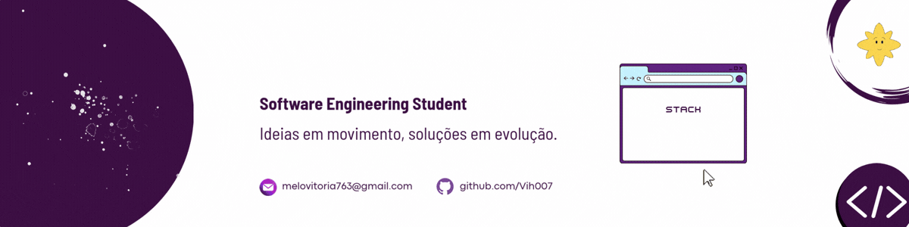

  

  

## 👋 Olá! Eu sou Vitória

🎓 Estudante de Engenharia de Software  
💻 Apaixonada por tecnologia, desenvolvimento web e bancos de dados  
🎯 Sempre em busca de aprender coisas novas e evoluir como desenvolvedora   
🎵 Amo ouvir música enquanto codifico  
🤝 Aberta a conexões, projetos colaborativos e novas oportunidades!
#

<h3 align="left">Connect with me!</h3>

#

<h3 align="left">My Stack: </h3>

  
  
  
  
  
  
  
  
  
  
  
  
  
  
  
  
  
  
  
  
  

#

  <h3>📊 GitHub Stats</h3>

  

  

